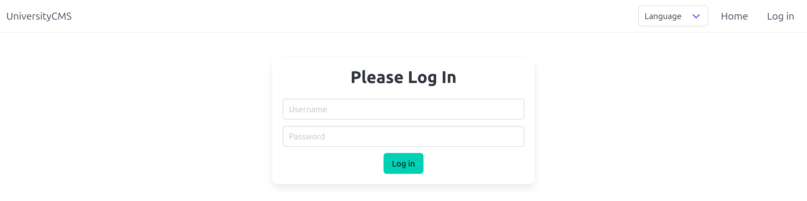
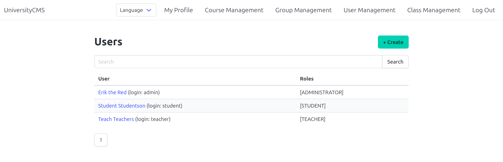
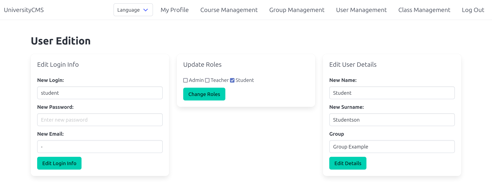
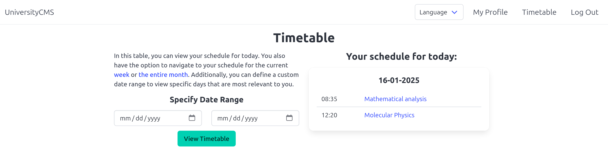

# Univesity Schedule Web Application
The University Schedule Web Application is a comprehensive tool for managing academic schedules.

## Dependencies
-   **Java 17**: Required for the application runtime.
-   **Maven**: For dependency management and building the project.
-   **PostgreSQL 16.4**: The application's database.
-   **Spring Boot**: Includes: Data JPA; Thymeleaf; Security;  Web.
There are a number of other third-party dependencies used in the project. Browse the Maven pom.xml file for details of libraries and versions used.
#### **Docker**
-   **OpenJDK 17-slim**: For running the Java application in a container.
-   **PostgreSQL Docker Image**: Official PostgreSQL image for the database.
-   **Flyway Docker Image**: Official Flyway image for database migrations.

## **Installation**
Follow these steps to set up and run the application:
#### **1. Prerequisites**
Ensure the following tools are installed on your system:
   -   **Docker** and **Docker Compose** (latest versions recommended)
   -   **Java 17 JDK**
   -   **Maven**
#### **2. Clone the Repository**
```bash
git clone https://github.com/AndPolovynko/university-cms
cd university-cms
```
#### **3. Build the Application JAR file**
```bash
mvn clean package
```
#### **4. Run the Application**
```bash
docker-compose up --build
```
The application will be available at http://localhost:8080.

## Features
#### **Administrator Features**
-   Manage courses, groups, users, class types, and venues (create, edit, delete, and search).
-   Schedule and manage classes with details like type, venue, course, groups, teachers, time, and date.
#### **Teacher Features**
-   **Personal Schedule**: View and navigate through a personalized schedule filtered by selected date range.
#### **Student Features**
-   **Group Schedule**: Access and navigate the schedule for their assigned group, filtered by selected date or range.
#### **Other Features**
-   Multi-language support: Choose between Ukrainian and English for the interface.

## Visuals




